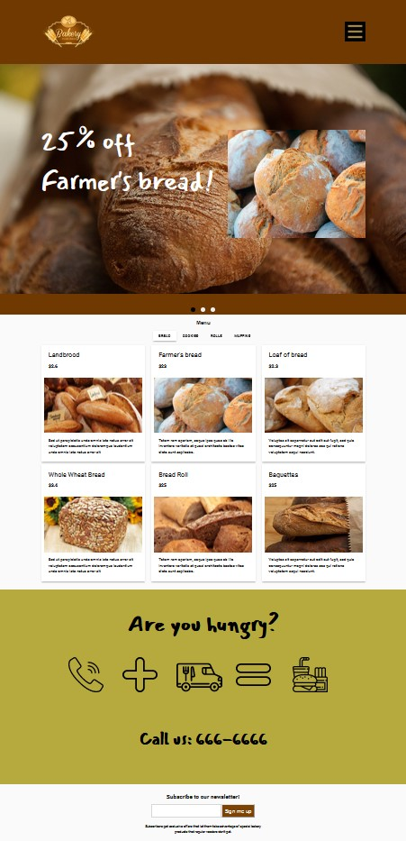

# Bakery app

A VueJS application for setting up a bakery shop. It uses Firebase to store data for the different categories of products on sale, has a slider to present the most popular items on sale with information on available discounts, has a newsletter signup form that validates user input and saves emails in the database. The app also features cool VueJS animations with different items appearing on the screen as you scroll down the page.

